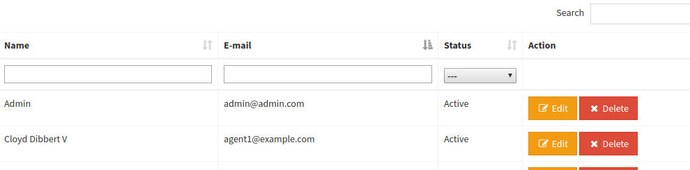

---

#### $this->setColumnIndividualSearch(array $array)

    Example:
    $this->setColumnIndividualSearch(['first_name','last_name']);

    
    Example:
    $this->setColumnIndividualSearch(['first_name','last_name', 'active'])
        ->column('active')->selectControl(['' => '---', '0' => 'Ні', '1' => 'Так']);

{: .image100}
