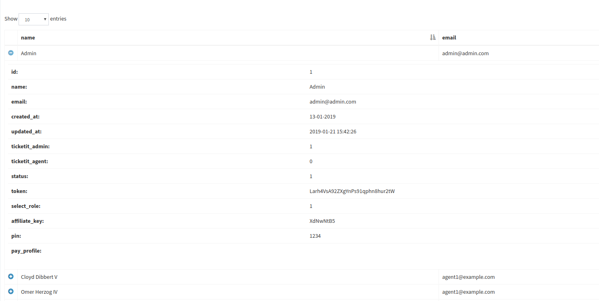
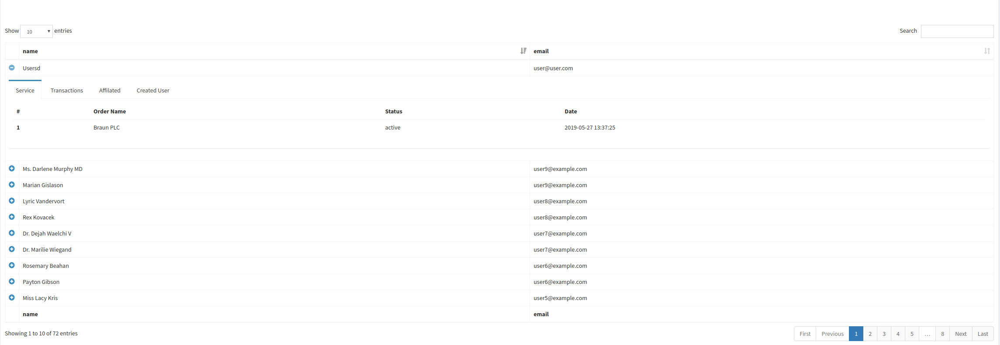

---

#### $this->showChildRows(funk funk)

#### Objects of the current record model are passed to the function.

    $this->showChildRows();

{: .image100}

`
Example:
`

    $this->showChildRows(function ($model, $view){
                    return view('history', compact('model'));
                });

{: .image100}
